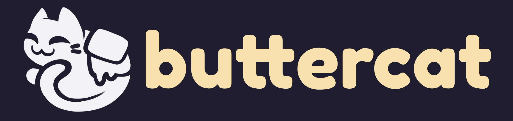

A modular, extensible, and easy to set up Twitch bot built on top of <a href="https://tmijs.com/">tmi.js.</a>

> **Warning**
> This project is a Work in Progress and is not yet ready for real world usage

## Current Features

- Modular plugin system
- Hooks for Twitch message events
- Ability to send messages in Twitch chat
- Spotify Requests plugin

## Future Features

Check out out the [Issues tab](https://github.com/buttercatbot/buttercat/issues) for planned features, and feel free to suggest more in the [Discussion section](https://github.com/orgs/ButtercatBot/discussions/categories/ideas)

## Examples

- [example-bot](/examples/example-bot)
- [example-plugin](/examples/example-plugin)

## Set up a Buttercat bot

Check out the [Getting Started section of the docs](https://buttercat.dev/guides/getting-started) for more info on how to set up a Buttercat bot

## Use a Pre-made Plugin

Check out the [Plugins section of the docs](https://buttercat.dev/plugins) for some pre-made plugins

## Make Your Own Plugin

Check out the [Create a Plugin guide](https://buttercat.dev/guides/create-a-plugin) for more info on how to make your own plugin

### Further Reading

- Check out the [examples folder](examples) for working examples

- Check out the [docs](https://buttercat.dev/docs) for more info on what you can do with plugins

## Acknowledgments

- [shadcn](https://shadcn.com) for the [component library](https://ui.shadcn.com/) used in the docs site
- [thelinmichael](https://github.com/thelinmichael) for the [Node Spotify API library](https://github.com/thelinmichael/spotify-web-api-node) used in the Spotify Requests plugin
